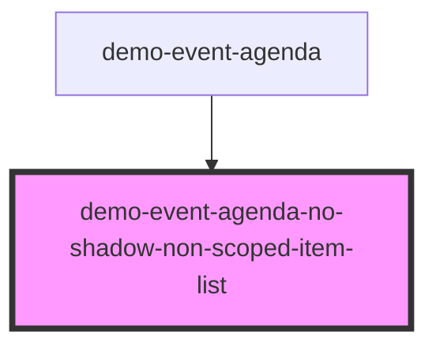

# demo-event-agenda-no-shadow-non-scoped-item-list

<!-- Auto Generated Below -->

## Properties

| Property | Attribute | Description | Type     | Default     |
| -------- | --------- | ----------- | -------- | ----------- |
| `talks`  | --        |             | `Talk[]` | `undefined` |

## Dependencies

### Used by

 - [demo-event-agenda](../demo-event-agenda)

### Graph

----------------------------------------------

*Built with [StencilJS](https://stenciljs.com/)*
